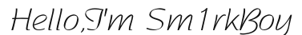

 

<h3 align="center">I'm a student from China who aspires to become a full-stack development engineer.</h3>

<h3 align="left">About me:</h3>

- 🌱 I’m currently learning **Vue** and **Java.**

- 📝 I regularly write articles on my [blog](https://sm1rkboy.xyz).

- 💬 Ask me about **[here](https://github.com/Sm1rkBoy/Sm1rkBoy/issues)**

- 📫 How to reach me **Sm1rkBoy7@gmail.com**

<h3 align="left">Languages and Tools:</h3>

                    

<h3 align="left">Stats:</h3>

&nbsp;

